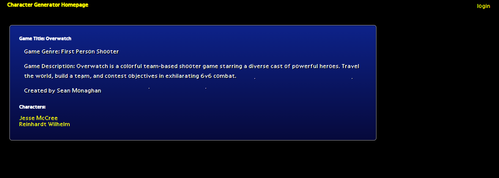

# Player Bank

[Description](#description) 

[Installation Instructions](#installation-instructions) 

[Site Overview](#site-overview) 
  

[Contribution Guidelines](#contribution-guidelines) 

[Tests](#tests) 
 
[Questions](#questions)

# Description

This application is designed to help game developers store game concepts and add either custom or randomly generated characters into them to help populate the game world.  Players can keep track of their own games and characters this way, while also viewing the works of other developers to get inspiration.  The application is built using Javascript, HTML5, CSS, Express.js, Handlebars and the database created using Sequelize and MySQL.  DotENV was used to secure information on the github repository.  The new technology that we used in this application was Charts.js to render the character attribute information in a way that the viewer can more easily process.  

Link to the Power point Presentation: 

https://docs.google.com/presentation/d/1kldrBhSlw1kZc8Dx1ZHcmsb4ffJT9KXD6s7D6iLnH5Y/edit#slide=id.gd49566cc19_2_5

## Installation Instructions

https://agile-peak-22805.herokuapp.com/

No need to install this application, it is live via Heroku and the link posted above.  

## Site Overview

Upon opening the site you are sent to the homepage where you can see characters and games created by existing users.  You can click on the game and see the information pertaining to it, as well as links to the characters in this game.  Upon clicking on a character, you are brought to a page that tells you more about that character and renders a graph based on their attributes.  You can also click to see what game they are a part of and view information on that game and other characters in that game, as well as who created the game.  

When you navigate to the profile page, which will become available to you after you register an account, you will be given the option to either create a game or a character.  Once you have created games, those games will be available to you in a drop down menu for you to select from so that when you create a character, you can add that character to that game.  All the stats for the character can either be custom entered or randomized by hitting the Randomize button.  Age can be anywhere from 16-100 while all stats are between 1-1000.  

If you want to add or delete a character, you can do so simply by clicking the delete button next to the character or game in question.  This way, you don't have to worry about experimenting with game or character concepts because they can always be undone.    

## License

This application uses the MIT license.

## Contribution Guidelines

If you would like to contribute to this project feel free to send requests.  I only wish that you be respectful to other contributes and to the code itself and maintain good clean coding practices. 

### Questions

If you have any questions about the application, be sure to contact me at my [e-mail](mailto:smonagha@conncoll.edu).

Alternatively you can find me and my other works at my [Github account](https://github.com/seanmonaghan).